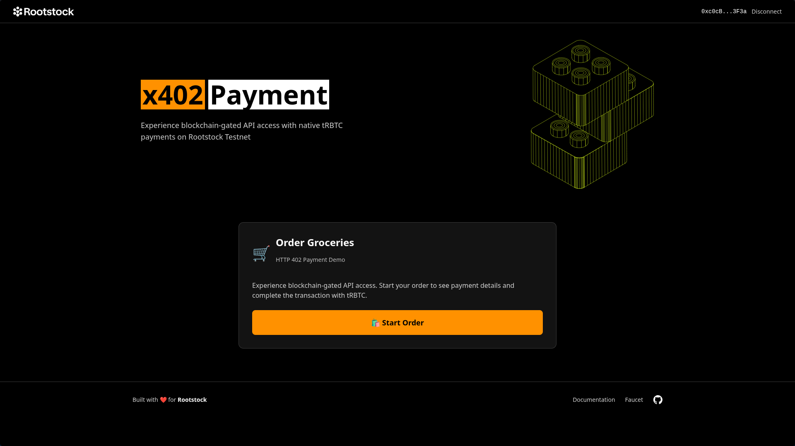

# 🚀 x402 Payment Starter Kit

A production-ready implementation of HTTP 402 "Payment Required" for cryptocurrency payments on Rootstock. Gate API access behind native tRBTC payments with blockchain verification.

<div align="center">
  
</div>

## What is x402?

The x402 protocol enables **pay-per-use APIs** using cryptocurrency:

1. Client requests resource → Server returns **402 Payment Required**
2. Client sends tRBTC payment on Rootstock blockchain
3. Client retries with payment proof → Server verifies and grants access

**Why Rootstock?** Bitcoin security + EVM compatibility + Low fees

## Architecture

```
Frontend (React + MetaMask)
    ↓
Merchant API (Express) ← → Facilitator (Transaction Verifier)
    ↓                              ↓
Rootstock Blockchain ← ← ← ← ← ← ←
```

## Project Structure

```
x402/
├── merchant-api/      # Express API (402 pattern)
├── facilitator/       # Transaction verifier
├── client-demo/       # CLI tool
├── frontend/          # React + Wagmi UI
└── README.md
```

## Prerequisites

- **Node.js** v18+ and npm
- **MetaMask** browser extension
- **Rootstock Testnet** configured in MetaMask:
  - RPC: `https://rpc.testnet.rootstock.io/<YOUR_API_KEY>`
  - Chain ID: `31`
  - Get tRBTC: [faucet.rootstock.io](https://faucet.rootstock.io/)
  - Get API Key: [rpc.rootstock.io](https://rpc.rootstock.io/)

## Quick Start

### 1. Install Dependencies

```bash
cd merchant-api && npm install && cd ..
cd facilitator && npm install && cd ..
cd client-demo && npm install && cd ..
cd frontend && npm install && cd ..
```

### 2. Configure Environment

Create `.env` files from examples:

**merchant-api/.env:**
```env
MERCHANT_ADDRESS=0xYourMerchantWalletAddress
PAYMENT_AMOUNT=0.0001
FACILITATOR_URL=http://localhost:4001
```

**facilitator/.env:**
```env
ROOTSTOCK_RPC=https://rpc.testnet.rootstock.io/<YOUR_API_KEY>
MIN_CONFIRMATIONS=1
```

**frontend/.env:**
```env
VITE_MERCHANT_API_URL=http://localhost:4000
```

### 3. Start Services (3 terminals)

```bash
# Terminal 1
cd facilitator && npm start

# Terminal 2  
cd merchant-api && npm start

# Terminal 3
cd frontend && npm run dev
```

### 4. Test Payment Flow

1. Open `http://localhost:3000`
2. Connect MetaMask (Rootstock Testnet)
3. Click "Start Order"
4. Click "Pay" and confirm in MetaMask
5. Wait ~30 seconds for confirmation
6. See order success!

## Components

- **merchant-api**: Express API implementing 402 pattern
- **facilitator**: Transaction verification service (Ethers.js)
- **frontend**: React UI with MetaMask (Wagmi + Viem)
- **client-demo**: CLI testing tool

## Testing

**Verify services:**
```bash
curl http://localhost:4001/health  # Facilitator
curl http://localhost:4000/health  # Merchant API
```

**Test 402 response:**
```bash
curl -X POST http://localhost:4000/api/order-groceries
```

**CLI testing:**
```bash
cd client-demo && npm start
```

## Configuration

- **Payment amount**: Edit `PAYMENT_AMOUNT` in `merchant-api/.env`
- **Confirmations**: Edit `MIN_CONFIRMATIONS` in `facilitator/.env`
- **RPC endpoint**: Edit `ROOTSTOCK_RPC` in `facilitator/.env`

## Troubleshooting

| Issue | Solution |
|-------|----------|
| Transaction not found | Wait 30-60 seconds |
| Wrong network | Switch to Rootstock Testnet in MetaMask |
| Balance is 0 | Get tRBTC from [faucet.rootstock.io](https://faucet.rootstock.io/) |
| Facilitator unavailable | Start facilitator service first |

## Resources

- [Rootstock Docs](https://dev.rootstock.io/)
- [Rootstock Faucet](https://faucet.rootstock.io/)
- [Block Explorer](https://explorer.testnet.rootstock.io/)
- [HTTP 402 Spec](https://developer.mozilla.org/en-US/docs/Web/HTTP/Status/402)

## License

MIT License

---

**Built for the Rootstock ecosystem** • Bitcoin security + EVM compatibility
